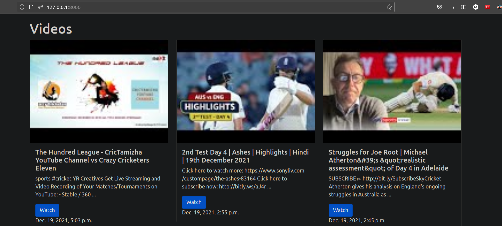
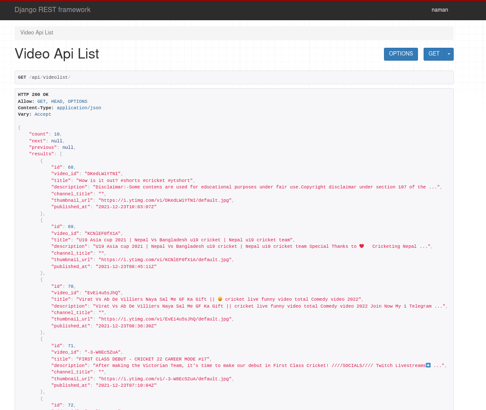

# ViewTube

## Table of Contents

- [About](#about)
- [Getting Started](#getting_started)- [Usage](#usage)
- [Screenshots](#ss)

## About <a name = "about"></a>
Get videos from Youtube based on pre-defined search parameter using the YouTube API as a background process.


### Prerequisites:

Clone the repository: 

```
git clone https://github.com/shadyskies/ViewTube.git
```
Docker should be installed.


## Usage <a name = "usage"></a>
Build and run the docker contaner using docker compose.

```
docker-compose 
```
## Screenshots <a name = "ss"></a>




